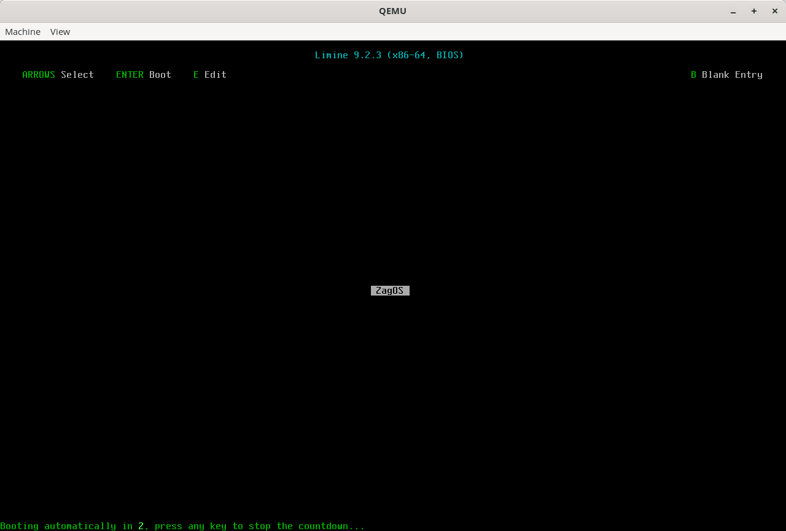

# ZagOS

[](https://github.com/artehe/ZagOS/actions)

An experimental toy kernel/OS written using [Zig][1] as much as possible. Assembly will be used where required for funtionality (e.g loading the GDT in x86/x64), however this ideally will be done using inline assembly rather than seperate assembly files.

Currently the only supported architecture is x86_64 (x64). However the project should hopefully be setup and configured in such a way that if I (or maybe someone else) decides they want to learn and support another architecture then this could be relatively easily implemented.



## Contents

- [Features & Roadmap](#features--roadmap)
- [Development](#development)
  - [Requirements](#requirements)
  - [Build](#build)
    - [Options](#options)
  - [Run](#run)
  - [Debug](#debug)
- [License](#license)
- [Contributing](#contributing)
- [Light reading](#light-reading)

## Features & Roadmap

All the features currently implemented and also the implementation progress of planned future features.

- Boot
  - [X] Boot with [Limine][2] into 64-bit (long mode)
- Kernel
  - [ ] Internal logging system using std log
  - Architecture
    - x86_64
      - [ ] Serial port I/O
      - [ ] GDT and TSS

## Development

This section contains all of the information you need to be able to build, run, debug, or test ZagOS.

### Requirements

There's a few tools required to build and/or run the OS. If you're on Ubuntu with snap installed (or similar) then you can just run the following commands and it will install everything you should need:

```shell
snap install zig --classic --beta
sudo apt update
sudo apt install build-essential gdb grub-common qemu-system-x86 xorriso
```

However if not then you'll need to install [Zig][1] 0.14.0 as well as ensure you have the following tools available on your system:

- grub-mkrescue
- make
- xorriso

If you want to do any debugging, testing, or running you'll probably want these as well:

- gdb
- qemu

### Build

You can build the OS by running:

```shell
make build
```

This will download the bootloader ([Limine][2]) and build it, before compiling the kernel and assembling everything together into a single bootable ISO image (`ZagOS.iso`).

#### Options

There's a couple of different options you can change in the `Makefile` to configure the OS. The available options are at the top of the file and all of the possible values are listed, you can also see the value below.

``` shell
# Available architecture targets: x86_64
ARCH := x86_64
# Available optimization levels = Debug, ReleaseSafe, ReleaseFast, ReleaseSmall
OPTIMIZATION_LEVEL := Debug
```

### Run

To generate and run an ISO image of ZagOS with Qemu you can run:

```shell
make run
```

This will launch the latest generated ISO image in Qemu with all the standard configured flags. These flags can be edited within the `Makefile` in case you wish to use a slightly different configuration for Qemu.

### Debug

You can run the ZagOS in debug mode which will then launch Qemu and then wait you to connect with gdb by using the command:

```shell
make run-debug
```

Alternatively if you use VS Code then this can be done from within the editor by using the inbuild tasks (or just press F5), this will then automatically connect with GDB for you.

## License

This project, with exception of the `ovmf` folder, is licensed under the Unlicense ([LICENSE](LICENSE) or <https://opensource.org/license/Unlicense>)

## Contributing

All contributions are welcome in whatever form, from bug reports to feature suggestions, or best of all pull requests.

## Light reading

Some very helpful documents which can be useful for developing this OS:

- [Limine Boot Protocol](https://github.com/limine-bootloader/limine/blob/trunk/PROTOCOL.md)

[1]: https://ziglang.org/
[2]: https://github.com/limine-bootloader/limine
