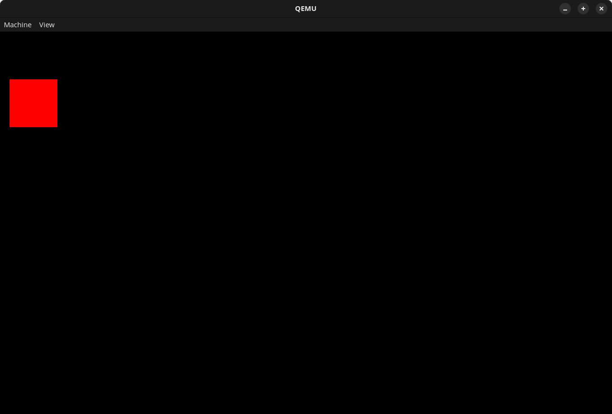

# ZagOS

[](https://github.com/artehe/ZagOS/actions)

An experimental toy kernel/OS written using [Zig][1] as much as possible. Assembly will be used where required for funtionality (e.g loading the GDT in x86/x64), however this ideally will be done using inline assembly rather than seperate assembly files.

Currently the only supported architecture is x86_64 (x64). However the project should hopefully be setup and configured in such a way that if I (or maybe someone else) decides they want to learn and support another architecture then this could be relatively easily implemented.



## Contents

- [Features & Roadmap](#features--roadmap)
- [Development](#development)
  - [Requirements](#requirements)
  - [Build](#build)
    - [Options](#options)
  - [Run](#run)
  - [Debug](#debug)
  - [Test](#test)
- [License](#license)
  - [3rd Party Acknowledgments](#3rd-party-acknowledgments)
- [Contributing](#contributing)
- [Light reading](#light-reading)

## Features & Roadmap

All the features currently implemented and also the implementation progress of planned future features.

- Boot
  - [X] Boot with [Limine][2] straight into 64-bit (long mode)
- Kernel
  - [X] Internal logging system
  - [X] Kernel stack
  - Panic
    - [ ] Print stack trace (and possibly other useful information) from panic
    - [ ] Expand Panic to output full stack traces and other useful information
  - Architecture
    - x86_64
      - [X] Serial port I/O
        - [ ] Apply a mutex to reading and writing with the serial port.
      - [X] GDT and TSS
      - Interrupts
        - [X] Setup IDT
        - [X] Enable Interrupts
        - [ ] Create ISR handlers
        - [ ] Create IRQ handlers
        - [ ] Load ISR and IRQs into IDT
        - [ ] Configure PIC
        - [ ] Configure APIC (then disable PIC)
      - Memory Management
        - [ ] Get the Memory Map from Limine
        - [ ] Physical Memory Manager
        - [ ] Virtual Memory Manager
        - [ ] Allocator
        - Paging
          - [ ] Higher Half, while already there we might want to work out if we ware in the right location or do we want to move
          - [ ] Ensure the permissions of the different kernel ELF sections are correctly applied, for example .text should be read-only, .data should be read-write, .rodata should be read-only, and .bss should be read-write.
  - Terminal
    - Framebuffer
      - [X] Request from limine
      - [X] Clear screen
      - [X] Draw pixels to screen.
    - Fonts
      - [X] Bundle font into kernel
      - [X] Load PSF fonts
      - [X] Draw fonts / characters
      - [ ] Parse Unicode table if there is one and use it.
      - [ ] Save font(s) to disk and then load dynamically as/if they are needed.
    - [X] Write text to screen
    - [ ] Apply a mutex to writing to the screen
    - [ ] Add color support
    - [ ] Add ANSI support: ANSI (American National Standards Institute) a standardised system of escape codes that modern computer terminals should understand. These escape codes allow a computer program to manipulate terminal color, text effects, clear the screen and move the text cursor around. [ANSI Escape Codes - Wikipedia](https://en.wikipedia.org/wiki/ANSI_escape_code).
    - [ ] Add Scrolling
    - [ ] Keyboard Input
    - [ ] Add cursor?
  - [ ] Filesystem(s) & Storage drivers (HDD, CD, FLP, Ramdisk)
  - [ ] Internal Debugger
- Testing
  - [X] Setup test framework for OS using a custom test runnner
  - [X] Integrate test framework with GitHub actions CI
  - [ ] Don't always run tests in the same order (we should probably have some way of regenerating the order that we use however)
  - [ ] Add configurable timeout to each test run (default 5 minutes?) in case we get a situation where we hit and endless loop?
- Long Term (probably the far far far far farrrrrrr future)
  - User Space
    - [ ] Switch to (Ring-3)
    - [ ] System Call(s)
    - [ ] Program Loading (ELF executables?)
  - [ ] ACPI parsing
  - [ ] Time / Timers
    - [ ] CMOS
    - [ ] PIT
    - [ ] HPET
  - [ ] Multithreading / Multiprocessing
    - [ ] Threads
    - [ ] Thread Local Storage
    - [ ] Thread Lists for different priority levels
    - [ ] Scheduler
      - [ ] A scheduler not ready for multiprocessing will probably be fully rewritten.
      - [ ] Priority Levels: Design in such a way, so threads/processes can have different priority levels.
    - [ ] Multiprocessing
    - [ ] Symmetric Multiprocessing
  - [ ] Graphics / User Interface
  - [ ] Networking
  - [ ] Sound
  - [ ] USB (Universal Serial Bus)
  - [ ] Porting Software (e.g compiler)?

## Development

This section contains all of the information you need to be able to build, run, debug, or test ZagOS.

### Requirements

There's a few tools required to build and/or run the OS. If you're on Ubuntu with snap installed (or similar) then you can just run the following commands and it will install everything you should need:

```shell
snap install zig --classic --beta
sudo apt update
sudo apt install build-essential gdb grub-common qemu-system-x86 xorriso
```

However if not then you'll need to install [Zig][1] 0.14.0 as well as ensure you have the following tools available on your system:

- grub-mkrescue
- make
- xorriso

If you want to do any debugging, testing, or running you'll probably want these as well:

- gdb
- qemu

### Build

You can build the OS by running:

```shell
make build
```

This will download the bootloader ([Limine][2]) and build it, before compiling the kernel and assembling everything together into a single bootable ISO image (`ZagOS.iso`).

#### Options

There's a couple of different options you can change in the `Makefile` to configure the OS. The available options are at the top of the file and all of the possible values are listed, you can also see the value below.

``` shell
# Available architecture targets: x86_64
ARCH := x86_64
# Available optimization levels = Debug, ReleaseSafe, ReleaseFast, ReleaseSmall
OPTIMIZATION_LEVEL := Debug
```

### Run

To generate and run an ISO image of ZagOS with Qemu you can run:

```shell
make run
```

This will launch the latest generated ISO image in Qemu with all the standard configured flags. These flags can be edited within the `Makefile` in case you wish to use a slightly different configuration for Qemu.

### Debug

You can run the ZagOS in debug mode which will then launch Qemu and then wait you to connect with gdb by using the command:

```shell
make run-debug
```

Alternatively if you use VS Code then this can be done from within the editor by using the inbuild tasks (or just press F5), this will then automatically connect with GDB for you.

### Test

Similar to previously all of the unit/integration tests can be run via:

```shell
make run-test
```

This will launch the OS in test mode the the custom [Zig][1] test runnner and execute all of the tests which are found outputting the results to the screen and producing an error code on failure.

## License

This project is licensed under the Unlicense ([LICENSE](LICENSE) or <https://opensource.org/license/Unlicense>), with the exceptions of the 3rd party software/assets which are noted below

### 3rd Party Acknowledgments

ZagOS depends on several other projects for assets and/or software. These dependencies are NOT covered by the for ZagOS License. These are instead licensed as described by each individual project's documentation, and with the licenses used by said projects linked in the list below:

- [Limine Bootloader][2] ([LICENSE](https://github.com/limine-bootloader/limine/blob/v9.x/LICENSES/LicenseRef-scancode-bsd-no-disclaimer-unmodified.txt))
- [Limine Zig][3] ([LICENSE](boot/limine-zig/LICENSE))
- [Tamsyn Font][4] ([LICENSE](assets/fonts/tamsyn-font-1.11/LICENSE))

## Contributing

All contributions are welcome in whatever form, from bug reports to feature suggestions, or best of all pull requests.

## Light reading

Some very helpful documents which can be useful for developing this OS:

- [Limine Boot Protocol](https://github.com/limine-bootloader/limine/blob/trunk/PROTOCOL.md)

[1]: https://ziglang.org/
[2]: https://github.com/limine-bootloader/limine
[3]: https://github.com/48cf/limine-zig
[4]: http://www.fial.com/~scott/tamsyn-font/
